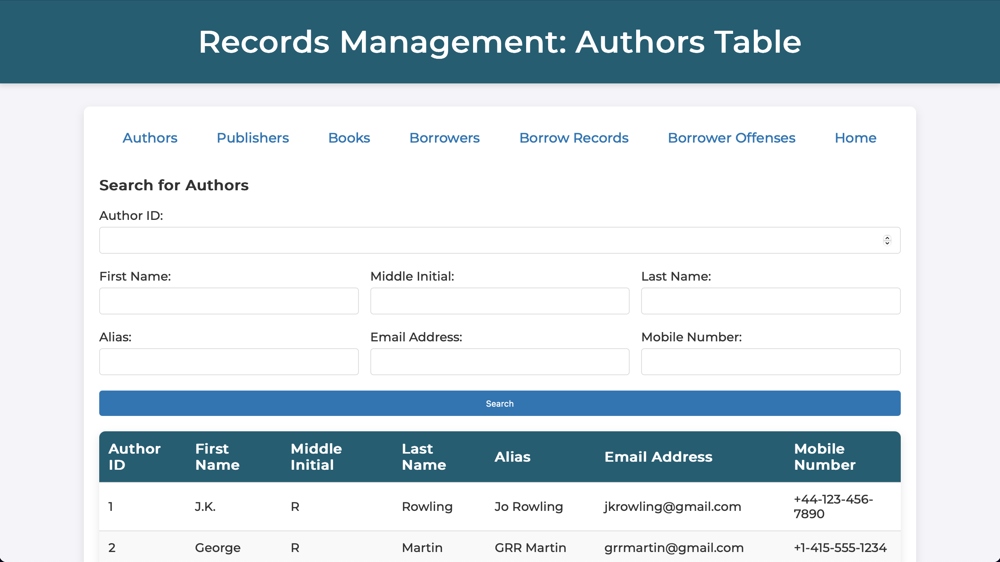
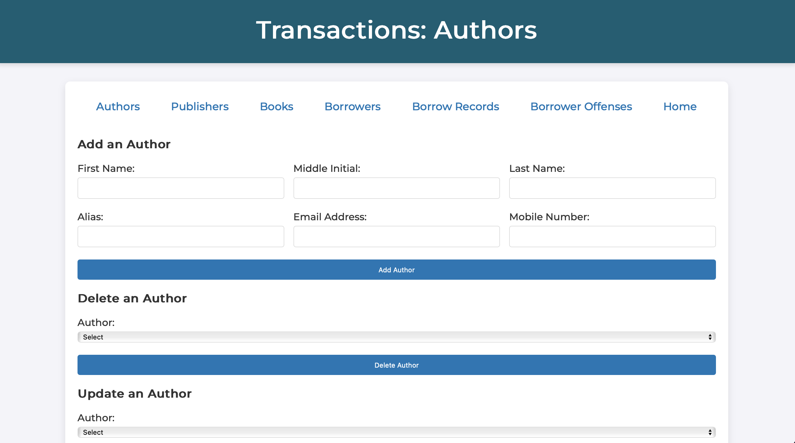
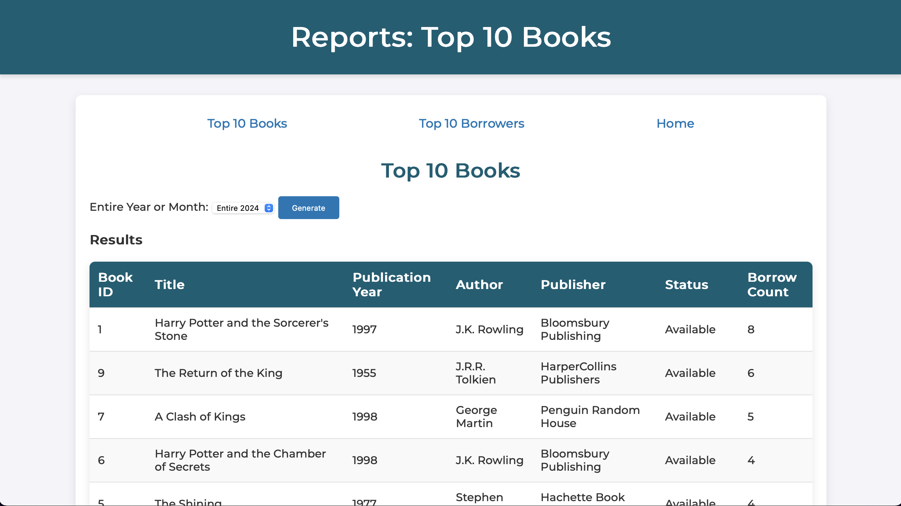

# Library Management System
#### Video Demo: [Insert URL Here]

#### Description:
Hello, my name is **Mark Edrian D. Celemen**, and this is my final project for CS50x, titled **Library Management System**. This project is designed to help manage a library's data, including tracking books, authors, publishers, borrowers, and borrow records. It also allows the library staff to manage transactions such as adding, updating, or deleting records, as well as generating reports for analysis. 

The core of the project is built upon a relational database that tracks the various entities related to the library’s operations. I started with the design and creation of the database schema, followed by populating it with random data to demonstrate the system's functionality. The project is implemented in Python using the **Flask** framework and is designed to be run on the CS50x IDE.

### Database Model
The first step in creating this Library Management System was designing the database. The database consists of multiple tables that track data about books, authors, publishers, borrowers, and borrow records. 

Here’s a brief overview of the tables included in the database:
- **Authors Table**: Stores information about authors, including their name, contact information, and alias.
- **Publishers Table**: Contains details about publishers, such as the publisher's name, address, and contact information.
- **Books Table**: Tracks books in the library, including their title, publication year, publisher, author, and availability status.
- **Borrowers Table**: Contains information about library borrowers, such as name, email address, and phone number.
- **BorrowRecords Table**: Records the borrowing details, including the date borrowed, expected return date, and actual return date, along with any late fees.
- **BorrowerOffenses Table**: Tracks any offenses committed by borrowers, such as overdue returns or damaged books.

Below is a screenshot of the **Library Management System Database Model**:

### Creating and Populating the Database
After designing the database schema, I created the database and populated it with random data to simulate a real-world scenario.

**Creating the Database**:
The database was created using SQL scripts in the CS50x IDE, and I made sure to carefully define the relationships between tables using foreign keys.

Here’s a screenshot of the **Creating the Database** process:

**Populating the Database**:
Next, I populated the database with sample data to demonstrate the functionality of the system. This included adding entries for authors, publishers, books, borrowers, and borrow records.

Here’s a screenshot of the **Populating the Database** process:

### Running the Project
This project was developed on the **CS50x IDE**, so it is recommended to run it within that environment for optimal performance. However, you can also run the project locally with a few modifications, such as setting up an SQLite database and installing the necessary dependencies.

### Files
The Library Management System consists of 21 files (excluding the database model and SQL script). These files are primarily written in Python and HTML and manage the different aspects of the system. The main components are:
- **app.py**: The main Flask application that runs the website and handles the logic for records management, transactions, and reports.
- **templates/**: This folder contains HTML files for the frontend interface, such as the landing page, records page, transactions page, and reports page.
- **static/**: This folder contains CSS and JavaScript files for styling and frontend interactivity.

### Core Features
The Library Management System has three main parts: **Records Management**, **Transactions**, and **Reports**. Below is a summary of each section:

Here’s a screenshot of the **Index** page:

#### 1. Records Management
The records management section allows users to view the data for each table in the database. It provides an interface where the library staff can view the list of authors, books, borrowers, and other relevant data stored in the database.

Here’s a screenshot of the **Records Management** page:

#### 2. Transactions
The transactions section enables users to perform actions such as adding, deleting, or updating records in the database. This feature makes it easy for the library staff to maintain accurate data on books, borrowers, and borrow records. For example, a library staff member can mark a book as borrowed, update borrow return dates, or remove outdated records.

Here’s a screenshot of the **Transactions** page:

#### 3. Reports
The reports section generates lists of the **Top 10 Most Borrowed Books** and the **Top 10 Borrowers** who have borrowed the most books. These reports can be used by library staff to analyze borrowing patterns and identify the most popular books and borrowers.

Here’s a screenshot of the **Reports** page:

### Design Choices
When designing this system, I made several key decisions to ensure that it would be both efficient and user-friendly:

- **Relational Database**: I chose to use a relational database with foreign keys to ensure that the data was normalized and could be efficiently queried. This design choice also ensures data integrity and prevents redundancy.
- **Flask Framework**: I decided to use Flask because it is a lightweight and flexible web framework that is easy to learn and ideal for small to medium-sized projects like this one. It allows me to focus on building the core features of the system without needing to worry about complex configurations.
- **Reports Section**: I included the reports feature to provide insights into the library’s usage and help with decision-making.

### Conclusion
The **Library Management System** project is a comprehensive application that provides an easy-to-use interface for managing books, borrowers, and transactions. With its database-backed design and user-friendly features, it can be a valuable tool for any library. The project showcases my understanding of SQL, Python, and web development, and I’m proud of how it turned out.

I hope you find this project useful and informative. Feel free to explore the code and try it out yourself!
